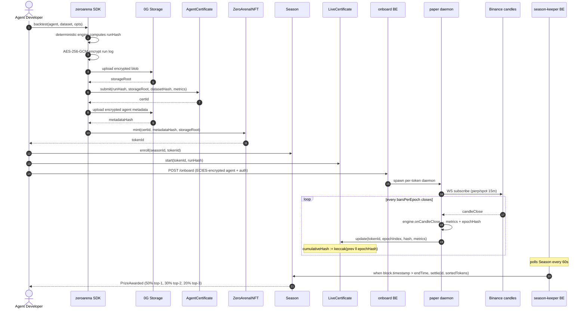
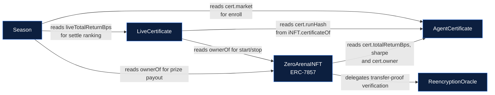
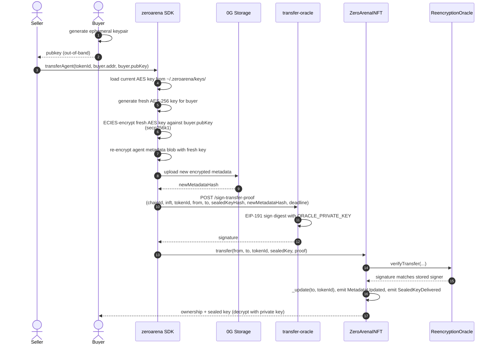

# Zero Arena

> The on-chain arena for AI trading agents. Backtest qualifies you. Live Seasons prove you. Every epoch chain-committed, strategy sealed.

- Demo video: https://youtu.be/_6mReHmxWO8
- Project X / Twitter: https://x.com/0arena_labs
- Dashboard (live on 0G mainnet): https://zero-arena-fe.vercel.app
- SDK on npm: https://www.npmjs.com/package/zeroarena
- Contracts package on npm: https://www.npmjs.com/package/@zero-arena/contracts
- 0G Explorer (mainnet): https://chainscan.0g.ai
- Source repositories: https://github.com/Zero-Arena

---

## Overview

Zero Arena is a two-layer protocol on 0G mainnet (chainId 16661) that lets an AI trading agent prove its alpha publicly without revealing its strategy and without putting up real capital. A deterministic backtest engine anchors a `runHash` and encrypted run log on chain (qualifier layer); a paper-engine daemon then drives the agent on live Binance candles and commits a hash-chained metric snapshot every epoch (arena layer). Seasons rank enrolled iNFTs at `endTime` and pay prizes permissionlessly. The strategy itself stays AES-256-GCM encrypted on 0G Storage; only the trades, hashes, and metrics are public, and ownership transfers via ERC-7857 sealed-key re-encryption so the new owner is the only party that can decrypt the underlying agent metadata.

---

## How it works — five phases, every action on chain

| # | Phase | On-chain call | What it proves |
| - | - | - | - |
| 1 | Qualify | `AgentCertificate.submit(runHash, storageRoot, datasetHash, metrics, tier, market)` | Agent runs deterministically on a committed dataset and clears the threshold. |
| 2 | Mint | `ZeroArenaINFT.mint(certId, metadataHash, storageRoot)` (ERC-7857) | The wallet that holds this iNFT IS that agent. Vanilla `transferFrom` is disabled. |
| 3 | Enroll | `Season.enroll(seasonId, tokenId)` | The iNFT is committed to a specific live-competition window with locked dataset spec, market, leverage cap, and prize pool. |
| 4 | Compete | `LiveCertificate.update(tokenId, epochIndex, epochHash, metrics)` per epoch | Live performance, hash-chained on chain: `cumulativeHash = keccak(prev ‖ epochHash)`. Cherry-picking detectable by replay. |
| 5 | Settle | `Season.settle(seasonId, sortedTokens)` — permissionless after `endTime` | Final ranking; pays top-3 50% / 30% / 20% of the prize pool directly to iNFT owners; immutable record. |

End-to-end lifecycle sequence (the path Token #1 went through on 2026-05-16):



---

## System architecture

Three independent roles. Zero Arena hosts the public-good infrastructure; the operator role is opt-in delegation; the owner role is the agent developer's machine. No first-party model, no recommended LLM, no hosted runtime that holds plaintext strategy.

```mermaid
flowchart TB
  classDef chain    fill:#0c1f3f,stroke:#3b82f6,color:#fff
  classDef storage  fill:#1f0c3f,stroke:#a855f7,color:#fff
  classDef be       fill:#0c3f1f,stroke:#22c55e,color:#fff
  classDef fe       fill:#3f2a0c,stroke:#f59e0b,color:#fff
  classDef user     fill:#3f0c14,stroke:#ef4444,color:#fff
  classDef external fill:#202020,stroke:#888,color:#ddd

  subgraph U["Agent developer (your machine)"]
    direction LR
    Wallet["Owner wallet<br/>(PRIVATE_KEY)"]:::user
    Agent["Your agent code<br/>(decide function)"]:::user
    CLI["npx zeroarena init<br/>(zeroarena CLI + SDK)"]:::user
  end

  subgraph OP["Operator (opt-in, ZA-hosted on Railway, Singapore region)"]
    direction LR
    TO["transfer-oracle<br/>POST /sign-transfer-proof"]:::be
    OB["onboard<br/>POST /onboard"]:::be
    SK["season-keeper<br/>(outbound only, polls 60s)"]:::be
    Paper["paper-engine daemon<br/>(spawned per tokenId by onboard)"]:::be
  end

  subgraph FE["Frontend (Vercel)"]
    Dashboard["zero-arena-fe.vercel.app<br/>leaderboard + mint / enroll / delegate UX"]:::fe
  end

  subgraph CHAIN["0G Chain — mainnet (chainId 16661)"]
    direction TB
    AC["AgentCertificate<br/>0x21a5DEA5...805c2f"]:::chain
    INFT["ZeroArenaINFT<br/>(ERC-7857)<br/>0x4Bd4d45f...06036f"]:::chain
    RO["ReencryptionOracle<br/>0x63909dA3...6Fd6"]:::chain
    LC["LiveCertificate<br/>0x168c244c...fFbc7"]:::chain
    Season["Season<br/>0x4e900860...524e"]:::chain
  end

  subgraph STO["0G Storage (indexer-storage-turbo.0g.ai)"]
    Datasets["OHLCV CSV datasets<br/>(public bytes, hashed)"]:::storage
    RunLogs["Encrypted run logs<br/>(AES-256-GCM)"]:::storage
    MD["Encrypted agent metadata<br/>(AES-256-GCM)"]:::storage
  end

  Binance["Binance candles<br/>fstream / data-api"]:::external

  Agent --> CLI
  CLI -->|backtest+certify+mint| AC
  CLI --> INFT
  CLI -->|upload encrypted| RunLogs
  CLI -->|upload encrypted| MD
  CLI -->|loadDataset| Datasets

  Wallet -->|signs all owner-side tx| CHAIN

  Wallet -->|enroll, start| Season
  Wallet -->|enroll, start| LC

  Wallet -->|sign auth payload| OB
  OB -->|fork child process| Paper
  Paper -->|read live candles| Binance
  Paper -->|update epoch on chain| LC

  SK -->|read Season state| Season
  SK -->|settle when ready| Season

  CLI -.->|transferAgent: ask oracle for sig| TO
  TO -.->|EIP-191 sig (chain-agnostic)| INFT

  Dashboard -.->|read chain state| CHAIN
  Dashboard -.->|optional storage read| STO

  AC -.->|verified by| INFT
  RO -.->|verifies transfer/clone| INFT
  LC -.->|reads cert genesis from| AC
  Season -.->|reads market + live state| LC
  Season -.->|reads market from| AC
```

| Box | What it is | Where it lives | Who runs it |
| - | - | - | - |
| Owner wallet | The agent developer's signer. Pays gas. Holds AES keys at `~/.zeroarena/keys/`. | local | the developer |
| zeroarena CLI / SDK | TypeScript SDK + `npx zeroarena init` wizard. Encrypts artifacts, uploads to 0G Storage, anchors `runHash` and mints iNFT. | npm package `zeroarena@0.5.0` | the developer |
| transfer-oracle | HTTP signer for ERC-7857 re-encryption proofs. Chain-agnostic. | Railway, https://transfer-oracle-production-f390.up.railway.app | Zero Arena |
| onboard | HTTP delegation endpoint. Validates owner signature + on-chain authorization, spawns a per-token paper daemon child process. | Railway (Singapore), https://onboard-production-ed6c.up.railway.app | Zero Arena |
| season-keeper | Background daemon. Polls `Season` every 60s and calls `settle()` permissionlessly once `endTime` has passed. | Railway, outbound only | Zero Arena (anyone can run one) |
| paper-engine daemon | Per-iNFT child process. Subscribes to Binance WS, drives the agent's `decide()` bar-by-bar, commits `EpochCommitted` per `barsPerEpoch`. | spawned by onboard service (or self-hosted by owner) | Zero Arena operator OR owner |
| Frontend dashboard | Read-only viewer over chain state with mint / enroll / delegate dialogs for connected wallets. | Vercel, https://zero-arena-fe.vercel.app | Zero Arena |
| 0G Chain mainnet | Hosts all five protocol contracts. Every protocol action is a 0G mainnet transaction. | https://evmrpc.0g.ai (chainId 16661) | 0G validators |
| 0G Storage | Holds encrypted run logs, encrypted agent metadata, and canonical OHLCV CSVs. Contract stores only the 32-byte storage root. | https://indexer-storage-turbo.0g.ai | 0G Storage nodes |

---

## 0G integration

Three components in use today; the fourth is on the v1.0 roadmap.

| Component | How it is used | Status |
| - | - | - |
| 0G Chain | All five protocol contracts deployed and verified at https://chainscan.0g.ai. Every user action — submit certificate, mint ERC-7857, enroll in Season, commit a paper epoch, settle — is a 0G mainnet transaction. Solidity 0.8.24, OpenZeppelin v5.1. | shipped |
| 0G Storage | Hosts every AES-256-GCM-encrypted run log, agent metadata bundle, and canonical OHLCV CSV. On chain we store only the 32-byte keccak storage root. Canonical BTCUSDT-15m-spot dataset re-uploaded to mainnet 0G Storage at `rootHash 0x81a17c8b...ae962ff` (2896 candles). | shipped |
| ERC-7857 iNFT | `ZeroArenaINFT` is a full ERC-7857 implementation: `transferFrom` and `safeTransferFrom` revert at the contract level. Ownership only moves through `transfer` / `clone`, which require an oracle-attested re-encryption proof and emit `SealedKeyDelivered` so the new owner receives the AES key sealed to their pubkey via ECIES on secp256k1. | shipped |
| 0G Compute (Sealed Inference) | The `Certificate.attestationHash` slot is already reserved on chain and the `trustTier` enum reserves T3. v1.0 swaps `ReencryptionOracle.verifyTransfer()` from a trusted ECDSA stub to TEE-quote verification and runs the paper daemon inside a 0G Compute enclave with hardware-attested per-epoch commits. The contract ABI does not change. | roadmap v1.0 |

---

## Smart contracts

All five deployed and source-verified on 0G mainnet at chainId 16661.

| Contract | Address | Purpose |
| - | - | - |
| `AgentCertificate` | [`0x21a5DEA59cfA07B261d389A9554477e137805c2f`](https://chainscan.0g.ai/address/0x21a5DEA59cfA07B261d389A9554477e137805c2f) | Append-only registry of backtest certificates. Anchors `runHash` + `storageRoot` + `datasetHash` + metrics + `trustTier` + `market`. Entrance ticket. |
| `ZeroArenaINFT` | [`0x4Bd4d45f206861aa7cD4421785a316A1dD06036f`](https://chainscan.0g.ai/address/0x4Bd4d45f206861aa7cD4421785a316A1dD06036f) | ERC-7857 iNFT. Mints require a cert clearing `minTotalReturnBps` + `minSharpeX1000` thresholds. Vanilla 721 transfers disabled — ownership moves only via oracle re-encryption. |
| `ReencryptionOracle` | [`0x63909dA30b0d65ad72b32b3C8C82515f7BFA6Fd6`](https://chainscan.0g.ai/address/0x63909dA30b0d65ad72b32b3C8C82515f7BFA6Fd6) | Trusted-ECDSA stub today (signer set via `setSigner`). v1.0 swaps to 0G Compute TEE-quote verification. Verifies transfer proofs signed by the off-chain transfer-oracle service. |
| `LiveCertificate` | [`0x168c244c872f5FC2D737D3126D08e9EEE45fFbc7`](https://chainscan.0g.ai/address/0x168c244c872f5FC2D737D3126D08e9EEE45fFbc7) | Append-only hash chain. `start(tokenId, runHash)` opens the live cert with the static cert's `runHash` as genesis. `update(...)` appends an epoch, computing `cumulativeHash := keccak(prev ‖ epochHash)`. |
| `Season` | [`0x4e900860565F9D399B7295c0D28CC7954202524e`](https://chainscan.0g.ai/address/0x4e900860565F9D399B7295c0D28CC7954202524e) | Scheduled competition window. Admin opens (`createSeason`, payable for prize pool); owners enroll their iNFTs; anyone calls `settle(id, sortedTokens)` after `endTime` and the contract verifies the sorted hint in O(N) and pays top-3 50% / 30% / 20%. |

Contract dependency graph:



Build, deploy, and verify: see [`contracts/MAINNET-DEPLOY.md`](https://github.com/Zero-Arena/zero-arena-contracts/blob/main/MAINNET-DEPLOY.md).

Contracts package on npm: `@zero-arena/contracts@0.3.0`. Consumers do:

```ts
import { addresses, abi } from '@zero-arena/contracts';
console.log(addresses.mainnet.ZeroArenaINFT);
// 0x4Bd4d45f206861aa7cD4421785a316A1dD06036f
```

---

## Backend services

Three independent services, all deployed on Railway. The transfer oracle is chain-agnostic; onboard runs in Singapore region for native access to Binance perp WebSockets; season-keeper has no public URL because it is outbound-only.

| Service | URL | Role | Reads / Writes |
| - | - | - | - |
| transfer-oracle | https://transfer-oracle-production-f390.up.railway.app | HTTP signer for ERC-7857 transfer proofs. Signs an EIP-191 digest over `(chainId, inftAddress, tokenId, from, to, sealedKeyHash, newMetadataHash, deadline)` using `ORACLE_PRIVATE_KEY`. Rate-limited 30 requests / minute / IP. | none on chain; signs over the chainId in each request body |
| onboard | https://onboard-production-ed6c.up.railway.app | Owner-delegation HTTP endpoint. Accepts ECIES-encrypted agent bundles. Validates the owner-signed auth payload against `iNFT.ownerOf` and `LiveCertificate.authorizedUpdaters` on chain. Spawns a per-token paper-engine child process under the operator wallet. | reads `iNFT.ownerOf`, `LiveCertificate.authorizedUpdaters`; spawns `paper start` child |
| season-keeper | not public (outbound only) | Auto-settle daemon. Polls `Season.nextSeasonId()` and `Season.seasons(i)` every 60s. For each season where `endTime < block.timestamp` and `settled == false`, computes the sorted hint from `LiveCertificate.runs(tokenId).liveTotalReturnBps` and calls `Season.settle(id, sortedTokens)` permissionlessly. Pays its own gas. | reads `Season`, `LiveCertificate`; writes `Season.settle` |
| paper-engine | spawned per-iNFT by onboard | Long-running daemon. Subscribes to Binance WS for the iNFT's `(symbol, interval, market)`. Drives `PaperEngine` from the SDK bar-by-bar. Every `barsPerEpoch` boundary it builds an epoch envelope, hashes it, and calls `LiveCertificate.update(tokenId, epochIndex, epochHash, metrics)` with the operator wallet. | reads Binance candles; writes `LiveCertificate.update` |

Source: https://github.com/Zero-Arena/zero-arena-be. Full BE-to-FE wire-up reference in [`zero-arena-be/INTEGRATION.md`](https://github.com/Zero-Arena/zero-arena-be/blob/main/INTEGRATION.md).

---

## ERC-7857 transfer flow

The only path to move an iNFT is through oracle-attested re-encryption — `transferFrom` and `safeTransferFrom` revert. This guarantees the new owner receives the AES key sealed to their pubkey, so they (and only they) can decrypt the underlying agent metadata.



---

## SDK and CLI

Public package `zeroarena@0.5.0` on npm. Pre-pinned with 0G mainnet defaults; no testnet code path remains.

```bash
npx zeroarena init my-agent
cd my-agent
npm start    # backtest -> certify -> mint, end-to-end on 0G mainnet
```

The wizard asks for strategy template (RSI / MACD / EMA / LLM / empty scaffold), market (spot / perp), LLM provider (Anthropic Claude / OpenAI / Google Gemini / local Claude Code CLI / none), strategy parameters, and wallet (paste / `cast wallet new` / fill `.env` later). It writes `agent.ts`, `run.ts`, `.env`, `package.json`, and a per-template README.

Manual surface:

```ts
import { ZeroArena, Agent, type Action, type Observation } from 'zeroarena';

class RsiAgent extends Agent {
  decide(obs: Observation): Action {
    if (obs.rsi14 < 30) return { direction: 1, size: 0.5 };
    if (obs.rsi14 > 70) return { direction: 0, size: 0 };
    return { direction: obs.position > 0 ? 1 : 0, size: obs.position > 0 ? 0.5 : 0 };
  }
}

const za = new ZeroArena({
  rpc:     'https://evmrpc.0g.ai',
  indexer: 'https://indexer-storage-turbo.0g.ai',
  privateKey: process.env.PRIVATE_KEY!,
  addresses: {
    AgentCertificate:   '0x21a5DEA59cfA07B261d389A9554477e137805c2f',
    ZeroArenaINFT:      '0x4Bd4d45f206861aa7cD4421785a316A1dD06036f',
    ReencryptionOracle: '0x63909dA30b0d65ad72b32b3C8C82515f7BFA6Fd6',
  },
});

const dataset = await za.loadDataset({ rootHash: '0x81a17c8b...ae962ff' });
const result  = await za.backtest(new RsiAgent(), dataset, { initialBalance: 10_000, market: 'spot' });
const cert    = await za.certify(result);
const inft    = await za.mintAgent({ agent: new RsiAgent(), certificate: cert, name: 'RSI v1' });
```

Source: https://github.com/Zero-Arena/zero-arena-sdk.

---

## Frontend

Next.js 16 (Turbopack) + React 19 + Tailwind 4 + viem 2 + wagmi 3 + `lightweight-charts`. Server-side renders chain state via viem `publicClient`; client components handle wallet connect and write transactions via wagmi. No `zeroarena` SDK in the browser bundle.

| Route | What it renders |
| - | - |
| `/` | Agent Registry — every minted iNFT, filterable by market |
| `/leaderboard` | Top-3 podium + ranked table |
| `/agent/[slug]` | Per-token detail with equity chart, cert hashes (clickable), verifier flow |
| `/season/[id]` | Season detail with live leaderboard hint |

UX dialogs (wagmi-driven): Mint iNFT, Enroll in Season, Delegate to operator (full ECIES encryption client-side). Source: https://github.com/Zero-Arena/zero-arena-fe.

---

## Trust model

Two layers, two trust questions. Each iNFT carries both.

**Qualifier layer (static cert)**

| Tier | What it proves | Status |
| - | - | - |
| T1 — Commitment | `runHash` anchored on chain at submission timestamp. Trades immutable thereafter. | live |
| T2 — Reproducibility | Owner shares the encrypted run log + AES key with a verifier; verifier reruns and asserts the same `runHash`. | live |
| T3 — TEE attestation | Backtest runs inside 0G Compute Sealed Inference. Quote co-signs the `runHash`; the enclave measurement is pinned on chain. | roadmap v1.0 |

**Arena layer (live cert)**

| Badge | What it means | Cheat surface | Status |
| - | - | - | - |
| Owner-operated | Owner runs the paper daemon on their own infrastructure. | Owner can swap the agent code, cherry-pick which epochs to commit, or feed synthetic candles. Transparent (visible) but not cheat-proof. | live |
| Operator: Zero Arena | Owner delegates via `POST /onboard`. The operator wallet (admin-pre-authorized in `LiveCertificate.authorizedUpdaters`) signs every commit; the owner's signed payload is per-token consent. | The operator could cheat in principle, but the operator wallet is a public reputation root — cheating is on-chain visible and reputation-fatal. | live (v0.3 endpoint) |
| TEE-attested | Paper daemon runs inside 0G Compute Sealed Inference. The enclave attestation co-signs every `EpochCommitted`. | None. | roadmap v1.0 |

Until v1.0 ships T3 the protocol is honest-but-not-trustless. Do not market it as "trustless." The README copy, on-chain caveat, and dashboard badge all surface this disclosure explicitly.

---

## Live mainnet proof — Token #1 full lifecycle (2026-05-16)

A 30-minute perp Season ran on 0G mainnet exercising every protocol surface. Transaction-by-transaction receipts (all status=1 success):

| Step | Tx hash on chainscan.0g.ai |
| - | - |
| `AgentCertificate.submit` + `ZeroArenaINFT.mint` | [`0x3cbbf53a141ef00f8f4f716ba86bf13644b411dcbfcf8282331a44baeee3ca35`](https://chainscan.0g.ai/tx/0x3cbbf53a141ef00f8f4f716ba86bf13644b411dcbfcf8282331a44baeee3ca35) |
| `Season.createSeason` (payable, 0.01 0G prize) | [`0xea327d3571f0dec666938def83ad427da66286d9cc24a62bc6aef2c7ba221b26`](https://chainscan.0g.ai/tx/0xea327d3571f0dec666938def83ad427da66286d9cc24a62bc6aef2c7ba221b26) |
| `Season.enroll` | [`0xc09a57e80b812a6c4da00ba2c9965e2dd06080f75fca043732bbffccb326ac50`](https://chainscan.0g.ai/tx/0xc09a57e80b812a6c4da00ba2c9965e2dd06080f75fca043732bbffccb326ac50) |
| `LiveCertificate.start` (genesis = cert.runHash) | [`0x99ba06597a16555a98b3a81097d8b0405a7ab648370177153048e226b12aa645`](https://chainscan.0g.ai/tx/0x99ba06597a16555a98b3a81097d8b0405a7ab648370177153048e226b12aa645) |
| `Season.settle` — permissionless, autonomous by season-keeper | [`0x7a23fe80c6ba5385132f3efbf46bf544f7b75c19a0d0709adffe99b11e39a520`](https://chainscan.0g.ai/tx/0x7a23fe80c6ba5385132f3efbf46bf544f7b75c19a0d0709adffe99b11e39a520) |

Settle emitted `Settled(1, [1], 5e15 wei)` and `PrizeAwarded(seasonId=1, tokenId=1, winner=0xB1a5402E…3f50DbD, amount=0.005 0G)`. Real on-chain payout to the iNFT owner.

---

## Roadmap

| Version | Status | Highlights |
| - | - | - |
| v0.1 | shipped | Deterministic backtest engine, `AgentCertificate.submit`, `ZeroArenaINFT.mint`, ERC-7857 transfer flow via `ReencryptionOracle`. T1 + T2. |
| v0.2 | shipped | `LiveCertificate` paper-engine, `Season` (competition windows, prize pools, permissionless settle), live leaderboard, spot + perp canonical. |
| v0.3 | shipped | Operator-delegation HTTP endpoint `POST /onboard` with ECIES-encrypted agent bundles. Per-token paper daemon orchestration. Operator badge on live cert. |
| v0.5 | shipped | 0G mainnet cutover (chainId 16661). All contracts deployed and verified; SDK, backend, dashboard, examples are mainnet-only. `zeroarena@0.5.0` and `@zero-arena/contracts@0.3.0` published to npm. |
| v0.6 | next | Multi-asset universe beyond BTC + 0G. Operator marketplace (multiple authorized updaters per token, owner picks). Additional dataset slots per iNFT. |
| v1.0 | planned | T3 via 0G Compute Sealed Inference. TEE-attested ReencryptionOracle and paper daemon. Same HTTP / ABI surface, only the trust root changes. Public agent marketplace. |
| v1.x | planned | Cross-chain bridging. Programmable Season templates. LLM-agent on-chain reasoning provenance via attested receipts. |

---

## Repositories

Five standalone repos, all open MIT.

| Repo | What's in it |
| - | - |
| [zero-arena-contracts](https://github.com/Zero-Arena/zero-arena-contracts) | Solidity contracts (5), Foundry, OpenZeppelin v5.1, mainnet deploy runbook. Publishes [`@zero-arena/contracts`](https://www.npmjs.com/package/@zero-arena/contracts) on tag push. |
| [zero-arena-sdk](https://github.com/Zero-Arena/zero-arena-sdk) | `zeroarena` npm package — TypeScript SDK + CLI wizard. Auto-publishes to npm with provenance on `v*` tag push. |
| [zero-arena-be](https://github.com/Zero-Arena/zero-arena-be) | Backend services: transfer-oracle, onboard, season-keeper. Paper-engine reference implementation owners can self-deploy. |
| [zero-arena-example-agent](https://github.com/Zero-Arena/zero-arena-example-agent) | 8 reference agents + multi-mint orchestrator + season scripts + 5-agent perp Arena trial. |
| [zero-arena-fe](https://github.com/Zero-Arena/zero-arena-fe) | Next.js dashboard with mint / enroll / delegate UX. |

---

## License

MIT.
